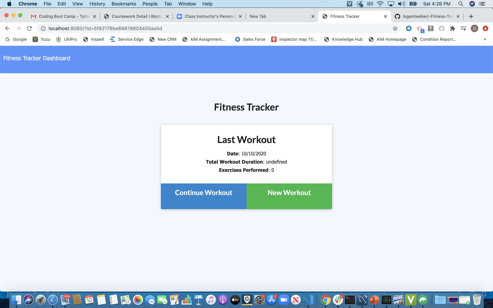
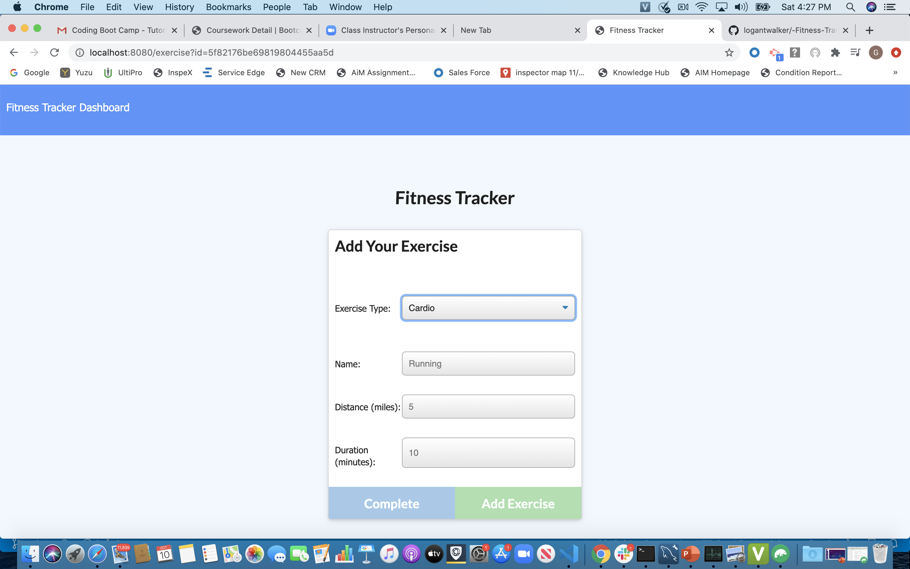
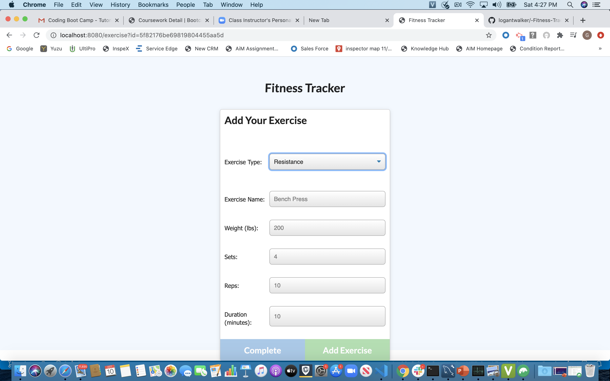
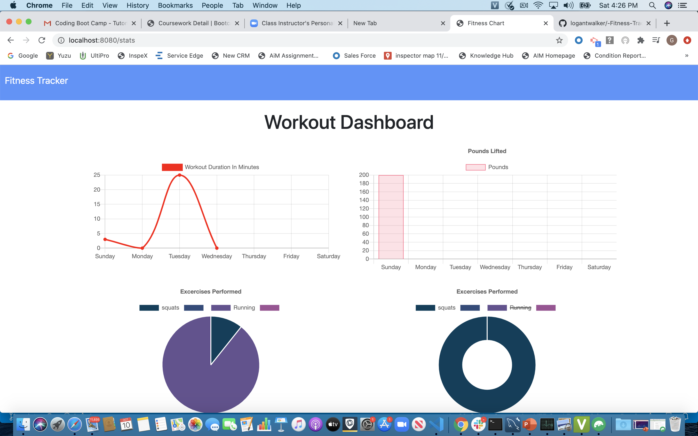

# Workout-Tracker

Workout-Tracker is an app that utilizes MongoDb/Mongoose to track workouts.

## User Story

- As a user, I want to be able to view create and track daily workouts. I want to be able to log multiple exercises in a workout on a given day. I should also be able to track the name, type, weight, sets, reps, and duration of exercise. If the exercise is a cardio exercise, I should be able to track my distance traveled.

## Business Context

A consumer will reach their fitness goals more quickly when they track their workout progress.

## Landing Page

## Adding Workout Exercises

## Exercise Stats Dashboard

## Link to Deployed Application

https://fast-fortress-57957.herokuapp.com/

## Support

For questions, comments or concerns regarding this portfolio, please email me at gmilteer@gmail.com

## Contributing

Georgia Milteer
